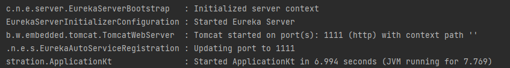
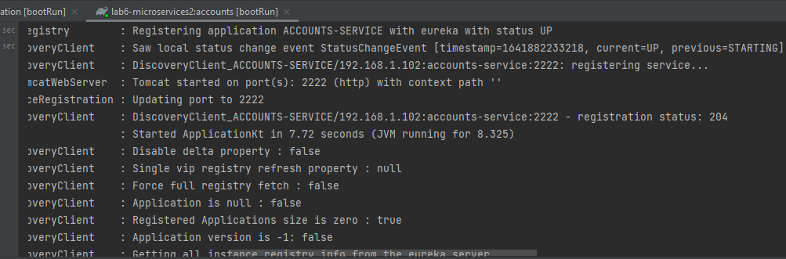
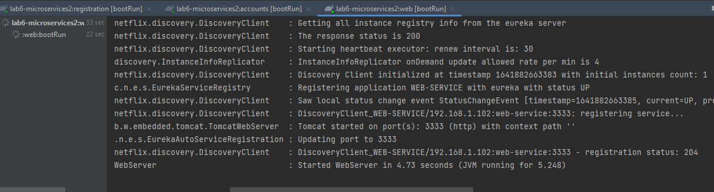
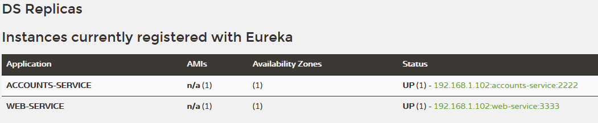
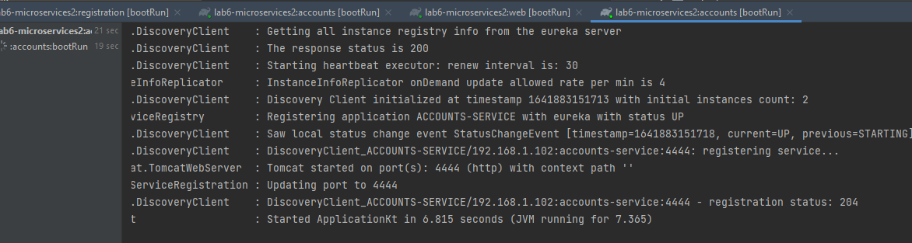
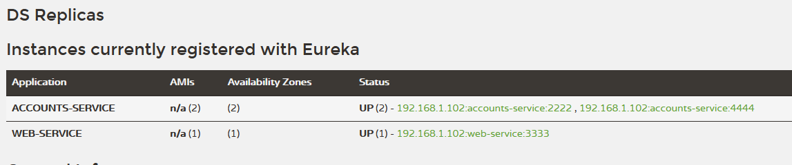
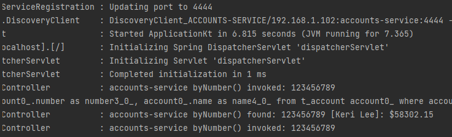
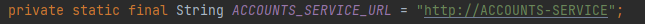
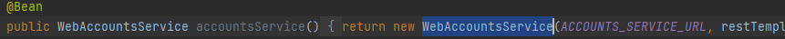
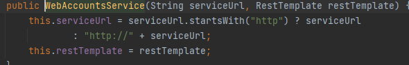

To register the services, first start the registration service with

./gradlew :registration:bootRun

Then start the accounts service:
./gradlew :accounts:bootRun

Same with the web service
./gradlew :web:bootRun

Both Services are up

Now, to add another of the same type, we need to change the port to avoid conflict:
To change accounts port, go to change it in accounts/main/resources/application.yml

Then, again ./gradlew :accounts:bootRun

There are now 2 account services avaiable.

After killing the service at port 2222, the request
fails with a 500 briefly, but later returns the data correctly.
That is because now it's using the service in the port 4444 rather than
the now unavaiable service in 2222.

That happens because the web service obtains the URI for the accounts service
from Eureka, so once Eureka realices the service at 2222 is dead, serves the direction
for the one in 4444.

